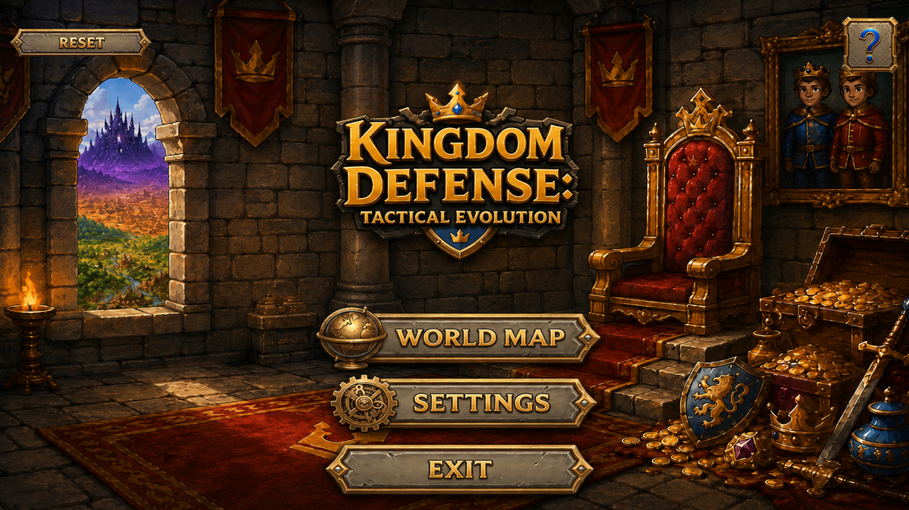
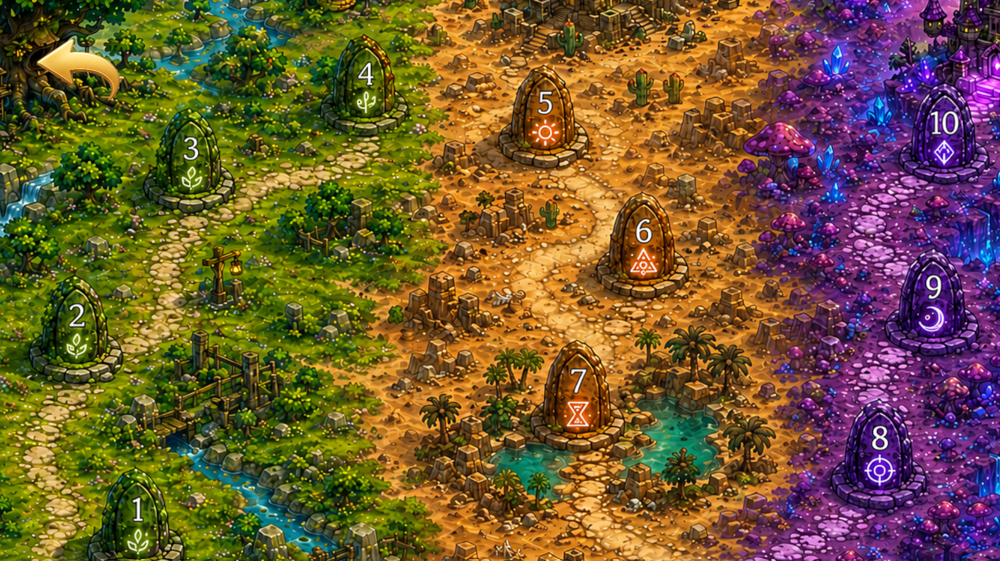
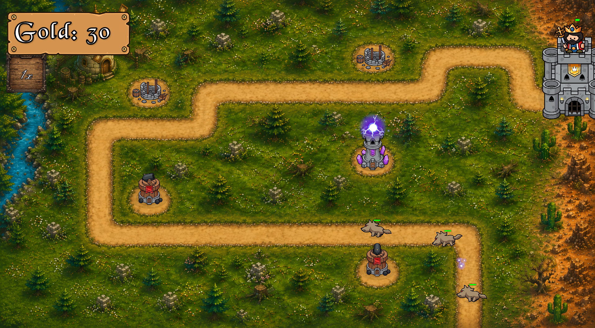
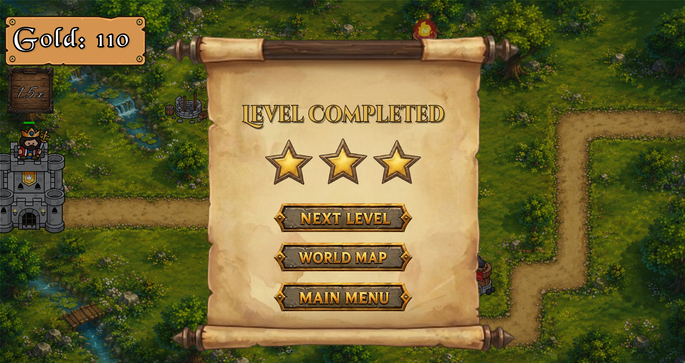

# 🛡️ Kingdom Defense: Tactical Evolution

**Kingdom Defense: Tactical Evolution** is a strategic Tower Defense game built in **Unity 6** and **C#**.  
The game features a full 10-level campaign, tower placement, upgrades, enemy waves, elemental effects, enemy resistances, unlockable tower slots, and a World Map progression system.

🎮 **Play the game here:**  
https://cosmiinn75.itch.io/kingdom-defense-tactical-evolution

> **Note:** Paid graphics and audio assets are excluded from this repository via `.gitignore` to comply with asset store licenses.

---

## ✨ Features

- 10 playable levels across multiple biomes
- World Map level selection with locked/unlocked progression
- Tower placement, upgrading, selling, and refund system
- Multiple tower types: Cannon, Crossbow, and Magic Tower
- Elemental magic system with Poison, Ice, and Lightning effects
- Enemy resistances: Armor, Magic, Slow, Poison, and Stun resistance
- Coroutine-based wave spawning system
- Economy system with gold rewards, upgrade costs, and sell refunds
- Unlockable tower slots for additional strategic decisions
- Tutorial, pause menu, settings menu, defeat screen, and level completed screen
- WebGL build published on itch.io

---

## 🛠️ Tech Stack

- **Engine:** Unity 6
- **Language:** C#
- **UI:** Unity UI, TextMeshPro
- **Deployment:** WebGL / itch.io
- **Architecture concepts used:**
  - Scriptable Objects
  - Coroutines
  - Singleton Managers
  - Data-driven enemy configuration
  - Runtime stat modification
  - Scene and progression management

---

## 🧠 Technical Highlights

### Data-Driven Enemy System

Enemy data is configured through Scriptable Objects, allowing values such as health, speed, rewards, resistances, and visual identity to be adjusted without rewriting gameplay logic.

This made it easier to create and balance multiple enemy types across the campaign.

---

### Coroutine-Based Wave Manager

The wave system uses Coroutines to control:

- enemy spawning
- enemy spacing
- wave progression
- delays between waves
- difficulty pacing

This allowed each level to have custom wave sequences while still using a shared spawning architecture.

---

### Tower Slot System

The tower slot system supports multiple states:

- empty slot
- occupied slot
- locked slot
- under construction state

This allowed the same slot architecture to handle normal building, tower upgrades, selling, and unlockable blocked slots.

---

### Tower Upgrade & Economy System

The player can build, upgrade, and sell towers using gold earned from defeating enemies.

The economy includes:

- tower costs
- upgrade costs
- insufficient gold feedback
- 80% sell refund system
- gold reward balancing across waves

---

### Elemental Magic System

Magic Towers can unlock elemental effects that change how they behave in combat:

- **Poison:** damages enemies over time
- **Ice:** slows enemies
- **Lightning:** briefly stuns enemies

Enemies can also have resistances that reduce or block certain effects, adding more strategic decision-making to tower placement and upgrades.

---

### World Map Progression

The game includes a World Map that tracks player progression.  
Completed levels unlock the next stage, while locked levels display a padlock icon to guide the player through the campaign.

---

### UI and Game State Management

The project includes multiple UI/game state screens:

- Main Menu
- Settings Menu
- Tutorial Menu
- Pause Menu
- Defeat Screen
- Level Completed Screen
- World Map level selection

These menus are connected to scene transitions, audio settings, player progression, and gameplay state changes.

---

## 📸 Screenshots

Add screenshots here:

```markdown




```

---

## 📂 Project Structure

```text
Assets/
├── Scripts/
│   ├── Enemies/
│   ├── Towers/
│   ├── Managers/
│   ├── UI/
│   ├── WaveSystem/
│   └── ScriptableObjects/
├── Prefabs/
├── Scenes/
├── Images/
└── Resources/
```

---

## 🚀 Current Status

The game is currently playable as a WebGL demo with:

- 10 integrated levels
- complete World Map progression
- tower building and upgrading
- elemental magic mechanics
- enemy resistances
- unlockable slots
- full victory and defeat flow
- tutorial and settings menus

---

## 🧪 Playtesting & Iteration

The game was published on itch.io and improved based on external player feedback.

Improvements made after feedback include:

- clearer tutorial flow
- improved UI consistency
- more readable menus
- better button responsiveness
- earlier access to the Magic Tower elemental system
- improved onboarding for core mechanics

---

## 📚 What I Learned

Through this project, I practiced:

- building a complete gameplay loop from scratch
- organizing Unity scenes, prefabs, and UI systems
- using Scriptable Objects for data-driven design
- managing enemy waves with Coroutines
- implementing tower placement, upgrades, selling, and economy logic
- debugging UI, state management, and gameplay issues
- balancing levels, enemy waves, tower costs, and rewards
- publishing a WebGL game on itch.io
- improving a project based on player feedback

---

## 🔮 Future Improvements

Planned or possible improvements:

- more enemy variety
- more tower upgrade branches
- more in-game tooltips and descriptions
- improved visual feedback for elemental effects
- better enemy resistance indicators during gameplay
- more polished animations and audio feedback
- additional balancing based on future playtesting

---

## 📜 Devlog

A detailed development log is available in [`DEVLOG.md`](DEVLOG.md).

---

## 👤 Developer

Developed by **Cosmin** as a Unity/C# learning project focused on gameplay programming, UI systems, game architecture, and publishing a complete playable project.
